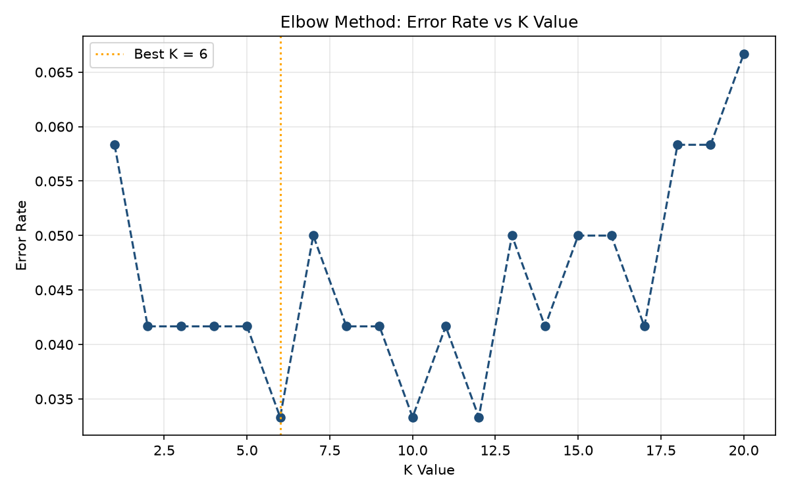
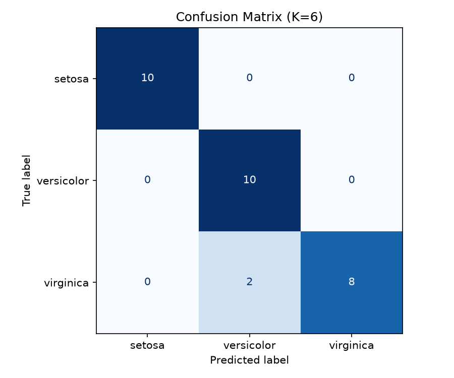

# Project: Data Classification Using AI
**DecodeLabs — AI Agent Fellowship 2026**
**Author:** Zahra | BS Artificial Intelligence | The University of Faisalabad

---

## 📌 Overview

Yeh project ek basic **supervised learning classification model** banata hai jo Iris flower dataset use karke teen species (Setosa, Versicolor, Virginica) ko unke sepal/petal measurements ke basis par classify karta hai.

Poora pipeline **IPO Framework (Input → Process → Output)** follow karta hai, jaisa fellowship guidelines mein bataya gaya tha.

---

## ✅ Requirements Fulfilled

| # | Requirement (from Project Brief) | Status |
|---|---|---|
| 1 | Load and understand a dataset | ✅ Done |
| 2 | Split data into training and testing sets | ✅ Done (80/20) |
| 3 | Apply a simple classification algorithm | ✅ Done (KNN) |

**Bonus concepts bhi cover kiye gaye:**
- Feature Scaling (StandardScaler)
- Optimal K selection via Cross-Validation (Elbow Method)
- Confusion Matrix
- Precision, Recall, F1 Score
- Scikit-learn workflow: Instantiate → Fit → Predict

---

## 🗂️ Files in this Project

| File | Description |
|---|---|
| `project2_classification.py` | Main script — poora pipeline isi mein hai |
| `elbow_curve.png` | K value vs Error Rate graph (best K dikhata hai) |
| `confusion_matrix.png` | Model ki predictions ka heatmap |
| `README.md` | Yeh file |

---

## ⚙️ How to Run

### 1. Requirements install karein
```bash
pip install numpy pandas matplotlib scikit-learn
```

### 2. Script run karein
```bash
python project2_classification.py
```

### 3. Output dekhein
- Terminal mein Step 1 se Step 6 tak sara process print hoga
- Same folder mein do naye graphs ban jayenge: `elbow_curve.png` aur `confusion_matrix.png`
- Inhe VS Code Explorer ya File Explorer se double-click karke dekha ja sakta hai

---

## 🧠 Methodology (Pipeline Steps)

1. **Load Dataset** — Iris dataset load kiya (150 samples, 4 features, 3 balanced classes)
2. **Feature Scaling** — `StandardScaler` se sab features ko same scale par laya (mean=0, variance=1), kyunke KNN distance-based algorithm hai
3. **Train-Test Split** — 80% training, 20% testing, stratified aur shuffled
4. **K Selection** — 5-fold Cross-Validation training set par use kiya taake best K mile bina test set ko "leak" kiye. K=1 ko jaan-boojh kar avoid kiya gaya kyunke woh overfitting/noise ka classic case hota hai
5. **Model Training** — `KNeighborsClassifier` instantiate → fit → predict
6. **Evaluation** — Accuracy, F1 Score, Confusion Matrix, aur detailed classification report generate kiya

---

## 📊 Visualizations

### Elbow Curve (Best K Selection)


### Confusion Matrix


---

## 📊 Results

| Metric | Value |
|---|---|
| Best K | 6 |
| Accuracy | 93.33% |
| F1 Score (weighted) | 0.9327 |

**Confusion Matrix Insight:**
- Setosa aur Versicolor 100% correctly classify hue
- Virginica ke 2 samples Versicolor samajh liye gaye (yeh dono species botanically kaafi similar hoti hain, isliye yeh expected/normal hai)

---

## 🔑 Key Learning

- Accuracy akeli kaafi nahi hoti, khaas kar jab classes imbalanced ho — isliye Confusion Matrix aur F1 Score dono dekhna zaroori hai
- Model tuning (jaise K choose karna) hamesha **training data** par honi chahiye, test set ko sirf final, unbiased validation ke liye "locked" rakhna chahiye

---

## 🚀 Next Steps (Future Improvements)

- Doosre classification algorithms (Logistic Regression, Decision Tree) se compare karna
- Model ko completely naye/unseen data par test karna
- Hyperparameter tuning ko `GridSearchCV` se aur automate karna

---

**Badge Status:** Project 2 Complete ✅
